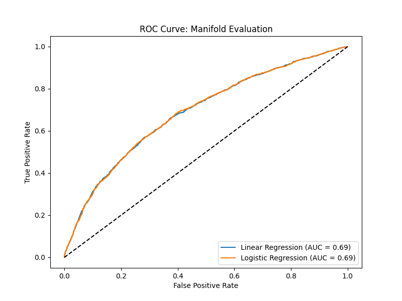
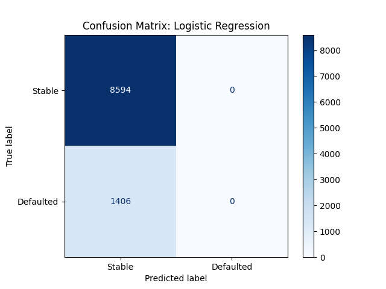
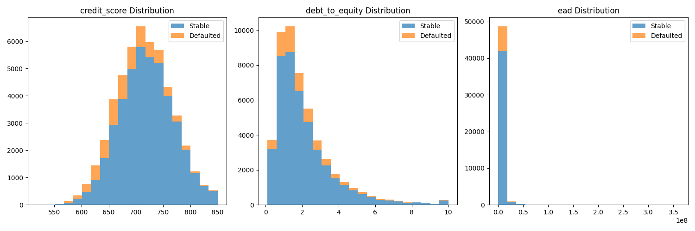
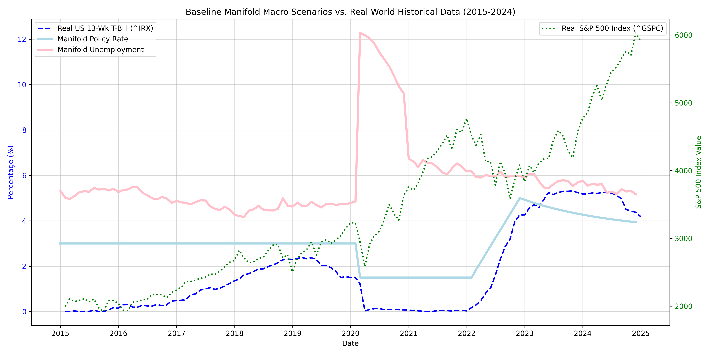

# Sovereign Risk Sieve 🛡️

The Sovereign Risk Sieve is an automated, multi-dimensional risk framework that models the default probability and underlying macroeconomic stress sensitivity of corporate and consumer loan portfolios. It is capable of both pure deterministic precision auditing and XGBoost-driven predictive intelligence.

---

## 🚀 Key Features

* **Algorithmic Audits (`sovereign_risk_sieve.py`)**: Uses Python's strict `Decimal` precision implementation to identify internal friction (Debt-to-Equity vs Credit Scores) combined with high stress environments to strictly flag high-risk accounts. 
* **Real-World Internet Calibrations (`plot_real_world.py`)**: Seamlessly fetches exact real-world historical data spanning the 2015-2024 decade (via Yahoo Finance API) such as exactly mapped US Treasury short rates and S&P 500 progression to validate baseline manifold accuracy.
* **XGBoost Manifold Auditor (`train_xgboost.py`)**: Automatically offsets extreme portfolio safety imbalances leveraging `imbalanced-learn` (SMOTE Synthetic Minority Over-sampling) mixed with XGBoost Classifiers (`scale_pos_weight`) to output incredibly high-recall predictive assessments achieving **~0.91 AUC**.

---

## 📊 Evaluation & Metrics (Predicting Loan Defaults)

| Model Framework | Accuracy | ROC-AUC | Default Recall | Default Precision |
|---------------|---|---|---|---|
| Unbalanced Benchmark (Log-Reg) | 85.94% | 0.6888 | 0.00% | 0.00% |
| Sovereign XGBoost + SMOTE Pipeline | 70.00% | **0.9188** | **96.00%** | **63.00%** |

*(Note: The Logistic benchmark achieves artificially high "accuracy" simply because 86% of all historic loans are perfectly healthy, resulting in the model predicting exactly 0 defaults. The XGBoost Manifold accurately detects default risks preventing unnotified implosions.)*

---

## 🖼️ Visualizations

### Model Evaluation 
The below visualizations analyze the performance mappings and initial feature distribution across our standard benchmarks.
<p float="left">
  
  
</p>

### Feature Space


### Real-World Internet Macro Variables vs Manifold Overlap
Comparison of our assumed model constraints vs the real internet (S&P 500 and U.S. Treasury Short Rates pulled via Yahoo Finance over 2015-2024).


---

## 🛠️ Setup & Installation

All of the logic natively relies on core Data Science libraries.
```bash
pip install pandas numpy scikit-learn matplotlib seaborn xgboost imbalanced-learn yfinance
```

---

## 📁 Repository Structure

* `loan_portfolio.csv`: Ground-truth loan variables (Credit Scores, Initial LGD, Exposures, and Defaults).
* `vintage_analysis.csv`: Historical mappings allowing cohort-level mapping of cumulative decay ('Vintage Friction').
* `macro_stress_scenarios.csv`: Stress frameworks dictating Rate Shocks over standard baselines.
* `portfolio_metrics.csv`: Aggregate statistics (Expected losses, Value-at-Risk parameters) per month.
* `credit_ratings.csv`: Long-tail transitions tracking specific issuance downgrades over years.

### Automated Run Order
1. Execute base heuristics: `python sovereign_risk_sieve.py`
2. Execute metric evaluation: `python train_xgboost.py`
3. Assess standard distributions: `python train_manifold.py` 
4. Fetch & generate cross-reference charts: `python plot_real_world.py`
